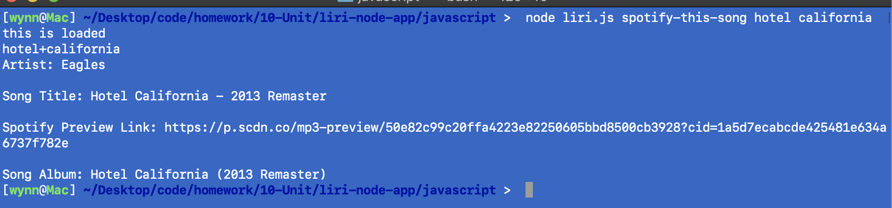
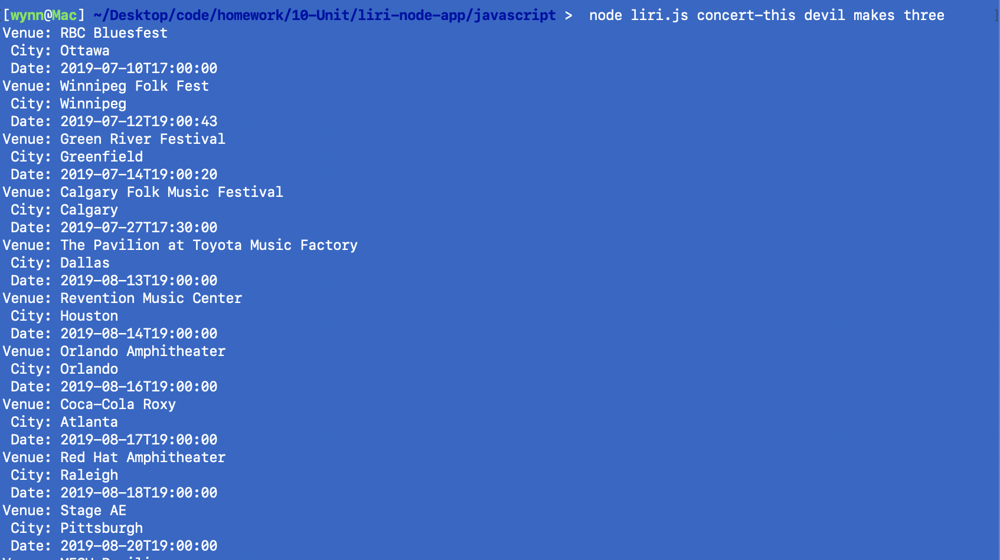
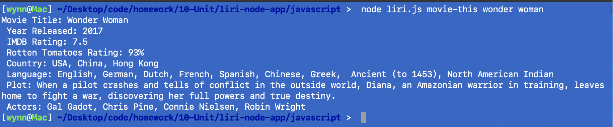

# liri-node-app

This app allows the user to input an action from one fo the following actions:
concert-this
spotify-this-song
movie-this
do-what-it-says

and look up a band's concert dates and cities; a song on spotify and get the artist and album the song is on; a movie that returns the title of the movie, the year the movie was released, the IMDB rating, the rotten tomatoes rating, the country where the movie was produced, the language the movie, the plot of the movie and the actors in the movie. The do-what-it-says opens the random.txt file and reads the action saved (spotify-this-song) and returns the spotify information for "I Want It That Way".

The app takes in the inputs of the user and runs the information in a switch case to determine which action to take. Once the action is determined the information the user is seeking is passed into the chosen function.

To run the app: while in the javascript folder type in the terminal: node liri.js (action goes here) (what to run the action on goes here) so it looks like node liri.js concert-this devil makes three.

Here are screenshots of the app:

<!--  -->

<!-- Format:  -->

;
;
;

The technologies used in the app are: nodejs, javascript, axios, npm.

I am the student that developed this app.